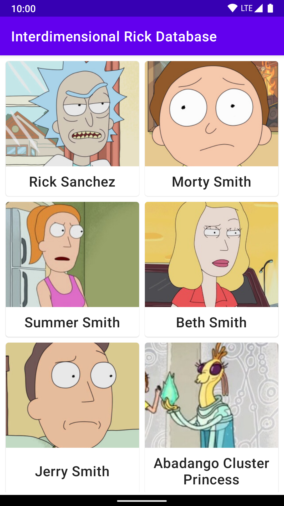
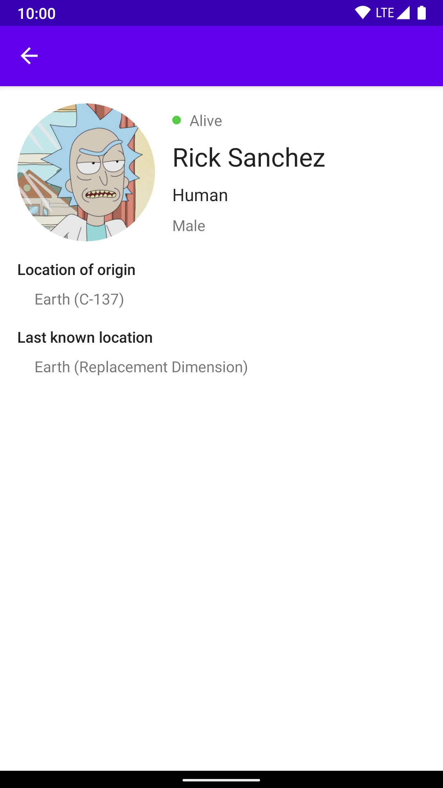

# Interdimensional Rick Database

Demo of Android recommended architecture patterns : MVVM, Navigation & Dependency Injection

## Screenshots

Character list | Character detail
-------------- | ----------------
 | 

## Credits

Rick and Morty is created by Justin Roiland and Dan Harmon for Adult Swim. The data and images, provided by [The Rick and Morty API](https://rickandmortyapi.com/), are used without claim of ownership and belong to their respective owners.

The demo's logo is derived from [The Rick and Morty API](https://rickandmortyapi.com/)'s logo, under BSD license.
